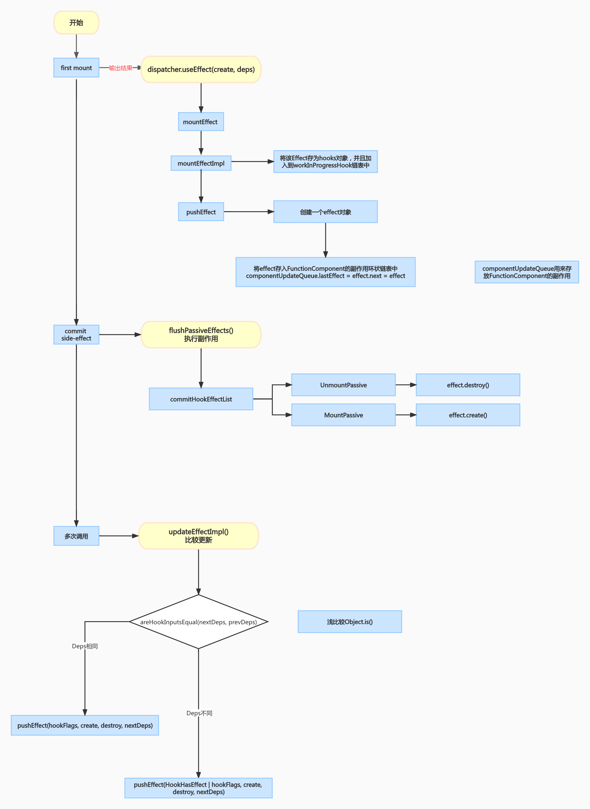
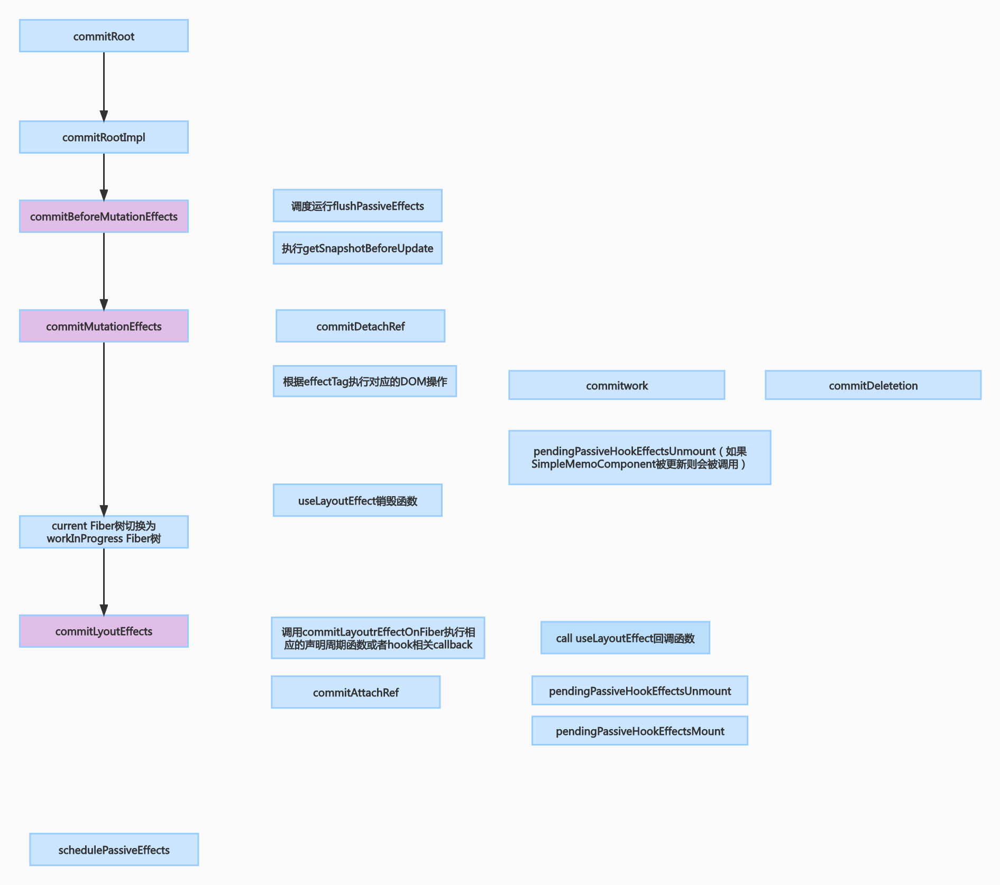

# React useEffect 前世今生

在使用 `useEffect` 的时候，我们可能会产生以下的疑问：

1. `useEffect` 一定要写在函数顶层吗?
2. `useLayoutEffect` 和 `useEffect` 哪个先执行，`destroy` 呢？

相信读完本文后，你能够对这些问题有更深入的理解。

## 为什么有 React Hook

1. class 组件书写复杂繁重，逻辑不容易复用
2. 函数组件无法存储状态
3. 函数组件无法拥有声明周期函数，因为每次都会重新调用（但对于 class 组件则不同，实际运行时是一个实例）

## useEffect 含义

effect 翻译过来就是副作用。实际上 `useEffect` 就是一个函数

## useEffect 用法

```
useEffect(fn, [deps])
```

其中, `fn` 是副作用引发的回调函数，还可以返回一个函数（会在组件卸载或者下一次更新前被调用）。`deps` 是依赖数组，需要开发者手动维护依赖数组。

## 源码表现

### 源码流程图



### 初始化时

在源码实现上也是一个函数，上源码：

```js
export function useEffect(
  create: () => (() => void) | void,
  inputs: Array<mixed> | void | null
) {
  const dispatcher = resolveDispatcher();
  return dispatcher.useEffect(create, inputs);
}
```

### dispatcher 是什么？

来看下 dispatcher 的结构：

```js
export type Dispatcher = {
  useState<S>(initialState: (() => S) | S): [S, Dispatch<BasicStateAction<S>>],
  useReducer<S, I, A>(
    reducer: (S, A) => S,
    initialArg: I,
    init?: (I) => S
  ): [S, Dispatch<A>],
  useEffect(
    create: () => (() => void) | void,
    deps: Array<mixed> | void | null
  ): void,
  useLayoutEffect(
    create: () => (() => void) | void,
    deps: Array<mixed> | void | null
  ): void,
  ...
};
```

可以看到 dispatcher 维护了 hook 的入口.

在 React 源码中，对应分了**两种 dispatcher**，比如 `HooksDispatcherOnMount` 、比如 `HooksDispatcherOnUpdate`（实际还有一种专门给错误提示用的：`ContextOnlyDispatcher`）。

虽然我们代码中仅仅是写了 `useEffect` 一份代码，但是在源码中，实际上分了 mount 和 update 两种情形，

所以，在函数组件初始化的时候，dispatcher 为 `HooksDispatcherOnMount`，此时会调用以下函数

```js
useEffect: function (create, deps) {
  currentHookNameInDev = 'useEffect';
  mountHookTypesDev();
  checkDepsAreArrayDev(deps);
  return mountEffect(create, deps);
}
```

### mountEffect 原理

那么 `mountEffect` 又是什么函数呢

```js
// https://github.com/facebook/react/blob/main/packages/react-reconciler/src/ReactFiberHooks.old.js
function mountEffect(
  create: () => (() => void) | void,
  deps: Array<mixed> | void | null
): void {
  return mountEffectImpl(
    UpdateEffect | PassiveEffect,
    HookPassive,
    create,
    deps
  );
}
```

下面会涉及到几个常量的概念，比如 `fiberEffectTag`、 `HookFlags`

#### fiberEffectTag

`fiberEffectTag` 是 fiber 定义的副作用的 tag，也就是常量，但这里很有意思的是，用的是二进制

```js
// Don't change these two values. They're used by React Dev Tools.
export const NoFlags = /*                      */ 0b000000000000000000;
export const PerformedWork = /*                */ 0b000000000000000001;

// You can change the rest (and add more).
export const Placement = /*                    */ 0b000000000000000010;
export const Update = /*                       */ 0b000000000000000100;
export const PlacementAndUpdate = /*           */ 0b000000000000000110;
export const Deletion = /*                     */ 0b000000000000001000;
export const ContentReset = /*                 */ 0b000000000000010000;
export const Callback = /*                     */ 0b000000000000100000;
export const DidCapture = /*                   */ 0b000000000001000000;
export const Ref = /*                          */ 0b000000000010000000;
export const Snapshot = /*                     */ 0b000000000100000000;
export const Passive = /*                      */ 0b000000001000000000;
```

为什么用二进制呢，我想有以下原因：

- 在一次渲染任务中可能会多次使用到这里的值，那么二进制的位运算就能够拉升运行时的性能。
- 同时如果我要表示多个副作用，比如我副作用包含 Placement 和 Update，那么 PlacementAndUpdate = Placement | Update 。按位运算还是很方便的。

### HookFlags

```js
export type HookFlags = number;

export const NoFlags = /*  */ 0b000;

// Represents whether effect should fire.
export const HasEffect = /* */ 0b001; // 有副作用

// Represents the phase in which the effect (not the clean-up) fires.
export const Layout = /*    */ 0b010;
export const Passive = /*   */ 0b100;
```

下面我们来看下 `mountEffectImpl`：

```js
function mountEffectImpl(fiberEffectTag, hookEffectTag, create, deps) {
  var hook = mountWorkInProgressHook(); // 返回一个链表
  var nextDeps = deps === undefined ? null : deps;
  currentlyRenderingFiber$1.effectTag |= fiberEffectTag;
  hook.memoizedState = pushEffect(
    HasEffect | hookEffectTag,
    create,
    undefined,
    nextDeps
  );
}

function mountWorkInProgressHook(): Hook {
  const hook: Hook = {
    memoizedState: null,

    baseState: null,
    baseQueue: null,
    queue: null,

    next: null,
  };

  if (workInProgressHook === null) {
    // This is the first hook in the list
    currentlyRenderingFiber.memoizedState = workInProgressHook = hook;
  } else {
    // Append to the end of the list
    workInProgressHook = workInProgressHook.next = hook;
  }
  return workInProgressHook;
}
```

`pushEffect` 原理：

```js
function pushEffect(tag, create, destroy, deps) {
  const effect: Effect = {
    tag,
    create,
    destroy,
    deps,
    next: (null: any),
  };
  let componentUpdateQueue: null | FunctionComponentUpdateQueue =
    (currentlyRenderingFiber.updateQueue: any);
  if (componentUpdateQueue === null) {
    componentUpdateQueue = createFunctionComponentUpdateQueue();
    currentlyRenderingFiber.updateQueue = (componentUpdateQueue: any);
    componentUpdateQueue.lastEffect = effect.next = effect;
  } else {
    const lastEffect = componentUpdateQueue.lastEffect;
    if (lastEffect === null) {
      componentUpdateQueue.lastEffect = effect.next = effect;
    } else {
      const firstEffect = lastEffect.next;
      lastEffect.next = effect;
      effect.next = firstEffect;
      componentUpdateQueue.lastEffect = effect;
    }
  }
  return effect;
}
```

`pushEffect` 的作用就是创建一个 Effect 对象，并把这个对象添加到 `componentUpdateQueue` 中，而在初始化的时候，又把 `componentUpdateQueue` 添加到了 `currentlyRenderingFiber` 中。通过这样把副作用和 fiber 产生了关联。

### 更新时

在函数更新的时候，会调用以下函数：

```js
function updateEffect(
  create: () => (() => void) | void,
  deps: Array<mixed> | void | null
): void {
  return updateEffectImpl(
    UpdateEffect | PassiveEffect,
    UnmountPassive | MountPassive,
    create,
    deps
  );
}
```

可以看到，这个函数和 `mountEffectImpl` 入参是一样的。

```js
function updateEffectImpl(fiberFlags, hookFlags, create, deps): void {
  const hook = updateWorkInProgressHook();
  const nextDeps = deps === undefined ? null : deps;
  let destroy = undefined;

  if (currentHook !== null) {
    const prevEffect = currentHook.memoizedState;
    destroy = prevEffect.destroy;
    if (nextDeps !== null) {
      const prevDeps = prevEffect.deps;
      if (areHookInputsEqual(nextDeps, prevDeps)) {
        pushEffect(hookFlags, create, destroy, nextDeps); // 注意，这里没有副作用，也需要pushEffect。保证Hook顺序相同
        return;
      }
    }
  }

  currentlyRenderingFiber.flags |= fiberFlags;

  hook.memoizedState = pushEffect(
    HookHasEffect | hookFlags, // 这里代表了有副作用
    create,
    destroy,
    nextDeps
  );
}
```

### commit 阶段调用时机



## useEffect 问答

### useEffect 依赖项对比是浅比较吗

在更新时会调用到 `updateEffectImpl`，具体可以看 `updateEffectImpl` 的实现，其中有一段 deps 的对比如下：

```js
function areHookInputsEqual(
  nextDeps: Array<mixed>,
  prevDeps: Array<mixed> | null
) {
  if (prevDeps === null) {
    return false;
  }
  for (let i = 0; i < prevDeps.length && i < nextDeps.length; i++) {
    if (is(nextDeps[i], prevDeps[i])) {
      continue;
    }
    return false;
  }
  return true;
}
```

可以看到对比的逻辑是依次取出依赖函数，然后进行 is 比较，`Object.is` 的实现是一个浅对比，也就是如果你直接修改原对象的一个 key 对应的 value 值，就会导致这里并不能触发调用，也就不会产生副作用。那么对应的解决方案是你可以使用不可变的方式，比如对象解构 `{...deps}`

### useEffect 与 useLayoutEffect 区别

大家可能都有个朦胧的概念是，两个副作用的回调的被调用时机是在 DOM 树被更新之后。具体执行时机还得看源码，由上一章节可以看到 `useEffect/useLayoutEffect` 都会在 commit 阶段被执行。

在 commit 阶段，分为 3 大循环：

commitBeforeMutationEffects： 调度运行 flushPassiveEffects。这个调度指的是以普通优先级，被推入了 **commit 阶段后** 的 task 中，在浏览器重排/绘制后，依次调用这些回调（异步）。
commitMutationEffects: 执行 DOM 操作。这里会附带一些组件的卸载，所以 useLayoutEffect 的销毁函数会在这里被调用。
commitLayoutEffect: DOM 树已经更新完毕了，此时会先调用 useLayoutEffect 的回调（同步），再进行 flushPassiveEffects 里面的这些 task

### useEffect 一定要写在函数顶层吗?

是的。因为所有的 hook 都会按顺序依次维护在 hook 链表中。假如你的某个 hook 不写在顶层，例如某个 hook 加了 `if` 判断，那么更新的时候，链表顺序则会对应不上初始化/上一次更新的 hook 的顺序了。

### useEffect 可以写 async 吗

不能, `useEffect` 第一个参数的 function 需要返回 `undefined` 或者另一个 `funciton`

### 如果有多个逻辑，使用多个 useEffect 还是一个 useEffect

回答是不同逻辑，应该分开使用不同的 `useEffect`。`componentUpdateQueue.lastEffect` 也会依次存入多个副作用的回调。

## useEffect 未来发展

### useEffect 依赖项是必填的吗

```js
In the future, the second argument might get added automatically by a build-time transformation.
For more detail, you could wath the share: React Forget：https://www.youtube.com/watch?v=lGEMwh32soc&t=2s
```

## 总结

翻看 `useEffect` 的源码，会发现 Hooks 的知识其实与 fiber、渲染的流程（render/commit 阶段）息息相关，也是借助了 fiber，React 才能够在函数中实现了 Hooks 的状态的存储。所以如果想真正了解透彻 hook 的涉及，就需要深入理解 fiber 的设计以及 React 渲染流程的原理。所以，我们接下来的源码解析将会继续学习 fiber 的设计以及 React 渲染流程，敬请期待！

## 参考文章

[https://overreacted.io/zh-hans/a-complete-guide-to-useeffect/](https://overreacted.io/zh-hans/a-complete-guide-to-useeffect/)

[全栈潇晨](https://xiaochen1024.com/courseware/60b1b2f6cf10a4003b634718/60b1b374cf10a4003b634725)

> 本文的作者是 Luo，来自 海码团 团队。
