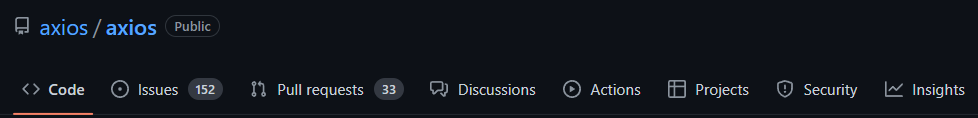
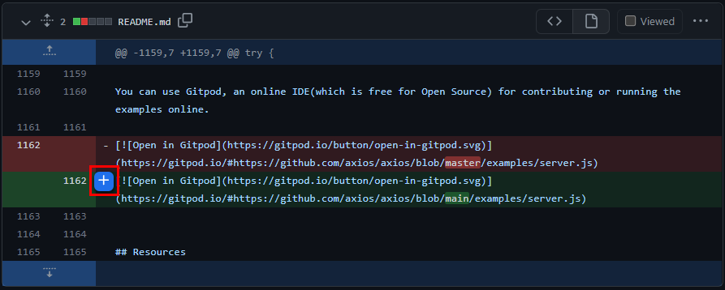
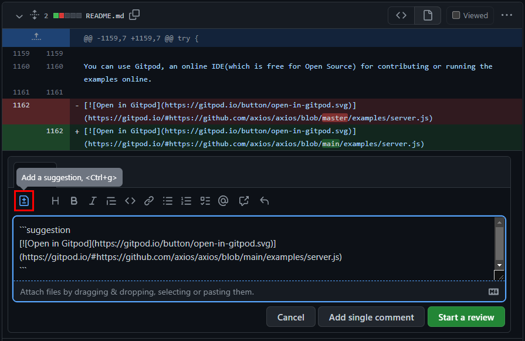

# 如何参与开源项目

## 引用

https://resources.github.com/devops/process/planning/discussions/

## 一点点前言

每个人对于开源都有自己的理解，对于毕业前的我而言，参与开源除了兴趣之外，当然也希望能丰富自己的简历。正是因为面向兴趣编程到面向收入编程的转变，刚开始工作的我有一些困惑，在半年后我才明白，技术对于商业运作而言只是一种工具。


所以我“开摆”了，将工作内外的编程解构为两个部分：「make money」 和 「make sense」。在工作一年后的今天，我对开源有了新的理解：在当前的社会环境下，它能够帮助你修正对于编程与自我价值的认知，感受你的输出对于世界发展的推动。

<!-- ## 说了这么多然后怎么参与呢

万事开头难，参与开源可能难在：

- 看不懂
- 能看懂一点，但是找不到可以贡献的点
- 找到了能贡献的点，但是不知道具体该怎么做 -->

## 如何找到贡献的点

<!-- ### 看不懂

你在编程的过程中接触到了某个开源项目，但是具体去看源码的时候发现很难看懂并且不知道从哪里入手。我的建议是如果你想了解一个项目，你最应该做的是了解它 API 的输入输出。

#### NPM 入口

对于每个 NPM 包而言，它都至少有一个“导出的接口”，这个入口文件一般是仓库根目录下的 `index.js`, `/src/index.js`, `/lib/index.js`，如果不好确定的话，可以看看它的 `package.json` 文件。

以 [axios](https://github.com/axios/axios/blob/v1.0.0-alpha.1/package.json) 为例：

```json
// https://github.com/axios/axios/blob/v1.0.0-alpha.1/package.json
{
  "name": "axios",
  "version": "1.0.0-alpha.1",
  "description": "Promise based HTTP client for the browser and node.js",
  "main": "index.js",
  "types": "index.d.ts"
}
```

以上是简化过后的文件，我们只需关注 `main` 和 `types` 字段。

- [main](https://docs.npmjs.com/cli/v8/configuring-npm/package-json#main)

这个字段标定了这个包的入口文件，即 <https://github.com/axios/axios/blob/v1.0.0-alpha.1/index.js> 是 axios 的入口文件。

- [types](https://www.typescriptlang.org/docs/handbook/declaration-files/publishing.html#including-declarations-in-your-npm-package)

这个字段标定了这个包的类型声明文件，即 <https://github.com/axios/axios/blob/v1.0.0-alpha.1/index.d.ts> 是 axios 的类型声明文件。

##### 类型

想要了解一个 API 的输入输出，类型文件能够很好的帮助我们。比如我想了解 `axios.get` 函数的第二个参数能传哪些值：

```ts
// https://github.com/axios/axios/blob/v1.0.0-alpha.1/index.d.ts#L282
get<T = any, R = AxiosResponse<T>, D = any>(url: string, config?: AxiosRequestConfig<D>): Promise<R>;
```

我们很快就能定位到第二个参数 `config` 的类型是 `AxiosRequestConfig<D>`，通过简单的搜索就能看到它的定义：

```ts
// https://github.com/axios/axios/blob/v1.0.0-alpha.1/index.d.ts#L127-L166
``` -->

一般来说在使用的过程中发现了问题才会参与贡献，但我们也可以主动寻找“问题”。

这是 [axios](https://github.com/axios/axios/tree/v1.0.0-alpha.1) 仓库的主页：



这里我们只需要关注前四个栏目：

- `Code`：浏览源码文件
- `Issues`：报告问题和可以改进的部分
- `Pull requests`：请求修改源码
- `Discussions`：探讨使用方法与未来发展方向

这里 `Issues` 和 `Discussions` 的功能有些重合。它们的区别在于，`Issues` 栏目的问题通常是开发者肯定了就是由源码导致的，而 `Discussions` 更多的是开发者提问使用方法或者最佳实践。

不同的栏目有不同的参与方式：

### Issues

这个栏目每天都会有新的问题产生，一些新手开发者可能会在这里提问，那么如果我们能作出解答并且提醒他在 `Discussions` 栏目提问更合适，就能帮助库维护者把精力放在更应该专注的问题上。

除了提问之外，剩下的内容通常可以分为 `bug` 和 `enhancement`。对于缺少细节的 `bug`，我们可以提醒他提供复现路径；对于已经提出过的问题，我们可以标记该问题重复并附上对应的链接。一些有经验的开发者除了提出问题之外，还会提供问题线索以及解决思路，我们可以通过这些信息来确认问题是否存在，并在明确问题与解决方向之后修改源码并请求合并。

### Pull requests

这个栏目的内容都是请求修改源码，我们可以帮助维护者做一些基本工作。

- 链接 issue

通常这些请求都是为了解决 `Issues` 区的内容，那么我们可以链接这个请求到对应的 `issue`，这样能够帮助库维护者明确这次代码修改是为了解决哪些问题，并且在代码合并后自动关闭对应的 `issue`。

- 代码审查

我们打开一个 `pull request`。


从左到右依次是：

- `Conversation`：讨论的地方
- `Commits`：查看 Git 提交历史
- `Checks`：查看仓库对于该 `pull request` 的检查
- `Files changed`：查看文件的改动
- `+346 -7`：绿色代表代码新增的行数，红色代表代码移除的行数

打开 `Files changed` 栏目，我们就能对文件的改动进行审查。如果我们认为其中某个部分不够明确，可以点击行号右侧的蓝色按钮进行留言：



如果我们确定一个地方应该重构，可以添加一条建议：



编辑完成后可以选择添加单条评论（Add single comment），或者继续审查其他代码（Start a review）。

### Discussions

在这个栏目可以参与大家对于项目的讨论，或者解答其他开发者提出的问题。提问者可以将你的回答标记为正确答案，这样就能帮助到更多人，同时你的 GitHub 首页将会解锁 Galaxy Brain 成就！

## 如何贡献源码

在我们明确了问题与解决方向之后，最直观的参与方式当然是贡献源码。在一次完整的源码贡献中，我们在各个环节都需要遵守项目的规定，例如 [axios](https://github.com/axios/axios/tree/v1.0.0-alpha.1) 的贡献规范：<https://github.com/axios/axios/blob/v1.0.0-alpha.1/CONTRIBUTING.md>。

阅读了这些内容之后，我们就可以正式发起一个 `pull request`：

1. 分叉项目仓库并克隆到本地

我们在项目主页的右侧点击 Fork 按钮创建一个该仓库的分叉，完成后克隆这个分叉到本地。


2. 创建分支

其实我们可以在主分支上直接修改源码并请求合并，但是创建分支可以让我们利用不同的分支并行解决不同的问题。

3. 修改源码并推送到分叉仓库上

一般修改源码都需要添加对应的测试，但无论我们添不添加新的测试，都必须保证原先的测试用例能够 100% 通过，以证明本次修改不会影响到其他逻辑。

4. 发起 `pull request`

我们进入项目仓库，就能看到 GitHub 提示我们可以发起 `pull request`，点击发起即可。

除非解决的问题和方式特别显而易见，否则我们应该在描述中讲明我们本次修改的用意，更好的做法是确保这个 `pull request` 有一个对应的 `issue` 用于说明问题。我们可以在描述中关联对应的 `issue`，这样库维护者就能快速了解本次修改的用意，并且在代码合并后由系统自动关闭该 `issue`。

- 修复漏洞

```
fixes (issue_link)
```

- 添加功能

```
closes (issue_link)
```
