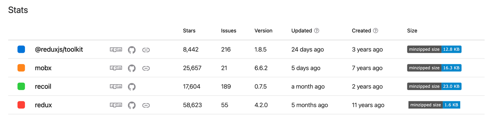
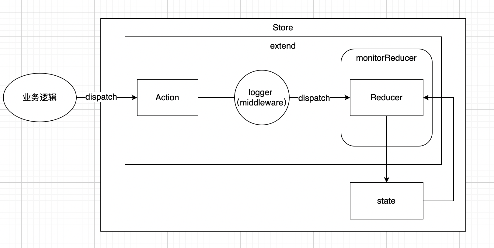

# Redux 从使用到源码解读

## 前言

React 的状态管理工具有很多，那本文为什么要选择 Redux 进行讲解呢？我们先看一下近一年不同状态管理工具之间的下载量数据：


可以看到 Redux 的下载量非常大，侧面反应了其使用的应用场景更多，经历过大量应用的考验，因此可以认为基本能够满足所有业务的应用场景，所以最终选择 Redux 来讲解，同时其他的指标也作为了考量标准，如下图：



因此优先对使用场景较大的 Redux 进行讲解，希望能够对 Redux 有更进一步的了解以帮助我们在日常的业务开发过程中能够快速上手使用和避坑。

### 目的

希望通过本文，可以让大家学习到 Redux 从使用到对其源码设计思想，主要包括以下内容：

1. 在大型项目中 Redux 用法及设计思想；
2. Redux 周边生态的了解；
3. Redux 大致框架设计和实现原理的源码解读；
4. Redux 的设计思想以及值得学习的地方；

## Redux 最佳实践

> Redux 是 JavaScript 应用的状态容器，提供可预测的状态管理。

当我们在项目中引入 Redux 就说明当前项目的复杂度较大或者需要多团队协作的场景，这也说明了引入 Redux 其实也需要进行相对麻烦的编码，导致这个问题的原因也正是源于 Redux 核心库灵活的设计思想，故意设计成非定制化的样子，且不受框架约束，而 Redux 也针对该问题提供了解决方案。

### Redux Toolkit

目前 Redux 官方强烈建议的最佳实践方案 Redux Toolkit，其对 Redux 进行了高度封装，能够以更加规范的方式在项目中使用 Redux，同时让我们减少了繁琐的 Redux 封装逻辑，具体介绍可以查阅官网 [Redux Toolkit | Redux Toolkit (redux-toolkit.js.org)](https://redux-toolkit.js.org/)

关于 Redux 代码风格这里就不做过多介绍，可自行查阅官网 [风格引导 | Redux 中文官网](https://cn.redux.js.org/style-guide/) ，以及 Redux 的 三大原则，这里主要讲一下在项目中 Redux 的整体结构设计上的最佳实践方案，首先从目录结构说起，当全局项目仅维护一个 store 时，大致结构如下：

```c
├── store     // 状态管理核心代码
│    ├── actions   // 多个业务逻辑 or 异步逻辑
│    ├── reducers   // 多个业务的 reducer 逻辑（包含 state）
│    ├── extends   // store 扩张（中间件等）
│    └── index.ts    // store 入口
```



其中 actions 和 reducers 文件夹下的文件拆分主要根据不同业务进行拆解。

如果涉及多团队之间的状态维护，则建议根据具体的业务领域进行多个 store 的业务模块划分，保证不同业务的状态之间完全隔离，方便维护。

### React Redux

> Redux 可以集成到任何的 UI 框架中，其中最常见的是 React 。[React-Redux](https://react-redux.js.org/) 是我们的官方包，它可以让 React 组件访问 state 和下发 action 更新 store，从而同 Redux 集成起来。

上面解决了 store 的设计问题，那么如果希望让 Redux 在 UI 框架 React 框架中相互绑定使用，那将需要使用 React-Redux 为我们做这件事情。

可以发现以上都是围绕 Redux 设计的周边生态产物，而 Redux 本身做了哪些事情，又是如何设计的，由此产生了这篇文章。

## Redux 整体架构设计

首先来看一张官网提供的数据流向图


首先看一下核心代码文件结构都包含哪些内容，如下：

```c
// src 目录下文件
├── applyMiddleware.ts
├── bindActionCreators.ts
├── combineReducers.ts
├── compose.ts
├── createStore.ts
├── index.ts    // 入口文件
├── types
│   ├── actions.ts
│   ├── middleware.ts
│   ├── reducers.ts
│   └── store.ts
└── utils
    ├── actionTypes.ts
    ├── formatProdErrorMessage.ts
    ├── isPlainObject.ts
    ├── kindOf.ts
    ├── symbol-observable.ts
    └── warning.ts
```

其中 `src/index.ts` 文件主要是函数统一导出的作用，其中包括使用到的 ts 类型和对外提供的主要功能函数，代码大致如下：

```ts
// src/index.ts
// functions
import createStore from './createStore';
import combineReducers from './combineReducers';
import bindActionCreators from './bindActionCreators';
import applyMiddleware from './applyMiddleware';
import compose from './compose';
import warning from './utils/warning';
import __DO_NOT_USE__ActionTypes from './utils/actionTypes';

/** ... 此处省略 types store 类型导出 */

/** ... dummy function 逻辑 */

// 顶级暴露的方法
export {
  createStore,
  combineReducers,
  bindActionCreators,
  applyMiddleware,
  compose,
  __DO_NOT_USE__ActionTypes,
};
```

可以看到顶级暴露的 5 个方法，在官网中也有对其进行说明 [API 参考 | Redux 中文官网](https://cn.redux.js.org/api/api-reference)，这里也简单概述一下其方法的作用：

- createStore：创建一个包含程序完整 state 树的 store。
- combineReducers：主要是多个不同 reducer 函数合并成一个最终的 reducer 函数键值对象。
- bindActionCreators：把一个对象中的不同 key 值转成拥有同名 key 的对象。同时使用 dispatch 对每个 action creator 进行包装，以便可以直接调用它们。
- applyMiddleware：可通过中间件的形式扩展 Redux 能力。
- compose：从右到左来组合调用多个函数。

也就是说 Redux 的主要功能就是它所对外暴露的 5 个方法，而这些方法之间的关系及能力可以通过下图了解：



那么到这里已经对 Redux 的整体代码结构有一定程度的了解，下面则开始主要对上述能力从源码角度来讲解其具体实现逻辑和思路。

## Redux 核心源码解读

这里主要讲一下 Redux 顶层对外暴露的几个方法，而 `src` 目录中的 `types` 和 `utils` 文件目录不进行单独解释，仅在对相关具体方法讲解时简略说明。

### createStore

该函数本质上就是一个闭包函数，将所有内部变量私有化，并通过向外暴露接口来进行数据读取和操作，首先看一下这个函数怎么使用，入参包含三个参数，分别是：

- reducer：必填参数，用于返回新状态树的纯函数，即根据 action 和当前状态树计算出新的状态树。
- preloadedState：选填参数，初始状态树。
- enhancer：选填参数，通过第三方能力例如中间件、时间记录器和日志等方式增强 store 能力。

```ts
// src/createStore.ts
export default function createStore<
  S,
  A extends Action,
  Ext = {},
  StateExt = never
>(
  reducer: Reducer<S, A>,
  enhancer?: StoreEnhancer<Ext, StateExt>
): Store<ExtendState<S, StateExt>, A, StateExt, Ext> & Ext;
export default function createStore<
  S,
  A extends Action,
  Ext = {},
  StateExt = never
>(
  reducer: Reducer<S, A>,
  preloadedState?: PreloadedState<S>,
  enhancer?: StoreEnhancer<Ext, StateExt>
): Store<ExtendState<S, StateExt>, A, StateExt, Ext> & Ext;
export default function createStore<
  S,
  A extends Action,
  Ext = {},
  StateExt = never
>(
  reducer: Reducer<S, A>,
  preloadedState?: PreloadedState<S> | StoreEnhancer<Ext, StateExt>,
  enhancer?: StoreEnhancer<Ext, StateExt>
): Store<ExtendState<S, StateExt>, A, StateExt, Ext> & Ext {
  /** ... 此处省略 */
}
```

先来看一下 createStore 的部分外层代码，声明了 3 个 createStore 函数，并且其入参内容都不一致，这里就涉及到了函数重载的概念，即方法名字相同，而参数不同，每个重载的方法（或者构造函数）都必须有一个独一无二的参数类型列表。这也是在使用的时候能够传入不同参数的原因。

下面来对函数体内部代码逻辑解释，总的来说该闭包函数内主要处理逻辑如下：

- currentState：维护闭包函数内当前的全局状态树；
- getState：提供获取当前闭包函数内的全局状态树；
- subscribe：订阅所有状态树更新的监听；
- dispatch：触发状态树更新；
- replaceReducer：动态替换 reducer 更新状态树逻辑；

```ts
// src/createStore.ts

/** ... 此处省略 入参类型判断 */

if (typeof preloadedState === 'function' && typeof enhancer === 'undefined') {
  enhancer = preloadedState as StoreEnhancer<Ext, StateExt>;
  preloadedState = undefined;
}

if (typeof enhancer !== 'undefined') {
  if (typeof enhancer !== 'function') {
    throw new Error(
      `Expected the enhancer to be a function. Instead, received: '${kindOf(
        enhancer
      )}'`
    );
  }

  // 如果有 enhancer 函数，则重写 store 以实现增强功能。
  return enhancer(createStore)(
    reducer,
    preloadedState as PreloadedState<S>
  ) as Store<ExtendState<S, StateExt>, A, StateExt, Ext> & Ext;
}

/** ... 此处省略 入参类型判断 */

let currentReducer = reducer;
let currentState = preloadedState as S;
let currentListeners: (() => void)[] | null = [];
let nextListeners = currentListeners;
let isDispatching = false;

// 对 currentListeners 进行浅拷贝，nextListeners 作为临时副本，避免在订阅/取消订阅是出现 listeners 数组处理异常的情况。
function ensureCanMutateNextListeners() {
  if (nextListeners === currentListeners) {
    nextListeners = currentListeners.slice();
  }
}

// 读取在 store 中存储管理的状态树
function getState(): S {
  if (isDispatching) {
    throw new Error(
      'You may not call store.getState() while the reducer is executing. ' +
        'The reducer has already received the state as an argument. ' +
        'Pass it down from the top reducer instead of reading it from the store.'
    );
  }

  return currentState as S;
}

// 添加监听器，订阅状态树发生变化时触发的函数。
// 在每次 dispatch 触发之前调用监听器。
// 返回值为取消订阅当前 listener 的事件逻辑。
function subscribe(listener: () => void) {
  if (typeof listener !== 'function') {
    throw new Error(
      `Expected the listener to be a function. Instead, received: '${kindOf(
        listener
      )}'`
    );
  }

  if (isDispatching) {
    throw new Error(
      'You may not call store.subscribe() while the reducer is executing. ' +
        'If you would like to be notified after the store has been updated, subscribe from a ' +
        'component and invoke store.getState() in the callback to access the latest state. ' +
        'See https://redux.js.org/api/store#subscribelistener for more details.'
    );
  }

  let isSubscribed = true;

  ensureCanMutateNextListeners();
  nextListeners.push(listener);

  return function unsubscribe() {
    // 该 listener 函数未被订阅，则不需要走取消订阅逻辑
    if (!isSubscribed) {
      return;
    }

    // store 正在执行 dispatch action 逻辑，不可以进行取消订阅逻辑
    if (isDispatching) {
      throw new Error(
        'You may not unsubscribe from a store listener while the reducer is executing. ' +
          'See https://redux.js.org/api/store#subscribelistener for more details.'
      );
    }

    // 更改 listener 函数的订阅状态
    isSubscribed = false;

    ensureCanMutateNextListeners();
    // 找到 listener 存在 nextListeners 的位置
    const index = nextListeners.indexOf(listener);
    // 从 nextListeners 中移除该 listener
    nextListeners.splice(index, 1);
    currentListeners = null;
  };
}

// 触发状态更改的唯一方法。
function dispatch(action: A) {
  /** ... 此处省略 入参类型判断 */

  // 正在执行 dispatch 则抛出异常
  if (isDispatching) {
    throw new Error('Reducers may not dispatch actions.');
  }

  try {
    // 设置正在执行 dispatch 的标记为 true
    isDispatching = true;
    // 更新当前状态树
    currentState = currentReducer(currentState, action);
  } finally {
    // dispatch 执行完成，更新标记为 false
    isDispatching = false;
  }

  // 当前状态树更新完成，触发所有监听器
  const listeners = (currentListeners = nextListeners);
  for (let i = 0; i < listeners.length; i++) {
    const listener = listeners[i];
    listener();
  }

  return action;
}

// 替换当前使用的 reducer 去计算新的 state，允许动态更新 reducer 行为。
function replaceReducer<NewState, NewActions extends A>(
  nextReducer: Reducer<NewState, NewActions>
): Store<ExtendState<NewState, StateExt>, NewActions, StateExt, Ext> & Ext {
  if (typeof nextReducer !== 'function') {
    throw new Error(
      `Expected the nextReducer to be a function. Instead, received: '${kindOf(
        nextReducer
      )}`
    );
  }

  // TODO: do this more elegantly
  (currentReducer as unknown as Reducer<NewState, NewActions>) = nextReducer;

  // 和 dispatch({ type: ActionTypes.INIT } as A) 函数执行的效果类似。
  // 当替换新的 reducer 时需要将先前的状态树填充到新的状态树中
  dispatch({ type: ActionTypes.REPLACE } as A);
  // change the type of the store by casting it to the new store
  return store as unknown as Store<
    ExtendState<NewState, StateExt>,
    NewActions,
    StateExt,
    Ext
  > &
    Ext;
}

// 兼容 observable 特性
function observable() {
  /** ... 此处省略 observable 代码逻辑 */
}

// 初始化状态树
dispatch({ type: ActionTypes.INIT } as A);

const store = {
  dispatch: dispatch as Dispatch<A>,
  subscribe,
  getState,
  replaceReducer,
  [$$observable]: observable,
} as unknown as Store<ExtendState<S, StateExt>, A, StateExt, Ext> & Ext;
return store;
```

该函数最后会返回一个 store 对象，提供给我们去管理和使用全局状态树的能力。以上就是 Redux 核心 API createStore 的所有源码内容。在 createStore 中 subscribe 使用了观察者模式，这也是 react-redux 能够通过监听 state 更新界面的主要原因，此外还利用了函数重载解决同一函数支持多种用法的场景。

### combineReducers

我们知道该函数主要是用于将多个 reducer 合并成一个 reducer，最后统一给到 createStore 中使用，同样先来看一下该函数如何使用，首先它同样是闭包函数，它支持传入一个对象参数，官网示例如下：

```ts
rootReducer = combineReducers({potato: potatoReducer, tomato: tomatoReducer})
// 这将返回如下的 state 对象
{
  potato: {
    // ... potatoes, 和一些其他由 potatoReducer 管理的 state 对象 ...
  },
  tomato: {
    // ... tomatoes, 和一些其他由 tomatoReducer 管理的 state 对象，比如说 sauce 属性 ...
  }
}
```

其实现源码也相对比较少，来大致看一下具体逻辑：

```ts
// src/combineReducers.ts
export default function combineReducers(reducers: ReducersMapObject) {
  // 获取 reducers 所有名称
  const reducerKeys = Object.keys(reducers);
  // 第一次过滤：过滤所有 reducers 中不是函数类型的键值对，并将符合条件的 reducers 存入 finalReducers 中。
  const finalReducers: ReducersMapObject = {};
  for (let i = 0; i < reducerKeys.length; i++) {
    const key = reducerKeys[i];

    if (process.env.NODE_ENV !== 'production') {
      if (typeof reducers[key] === 'undefined') {
        warning(`No reducer provided for key "${key}"`);
      }
    }

    if (typeof reducers[key] === 'function') {
      finalReducers[key] = reducers[key];
    }
  }
  // 获取过滤后的所有 reducers 名称
  const finalReducerKeys = Object.keys(finalReducers);

  // This is used to make sure we don't warn about the same
  // keys multiple times.
  let unexpectedKeyCache: { [key: string]: true };
  if (process.env.NODE_ENV !== 'production') {
    unexpectedKeyCache = {};
  }

  // 第二次过滤：判断 reducers 中传入的初始状态树是否合法。
  let shapeAssertionError: unknown;
  try {
    // 遍历 finalReducers 中的所有 reducers 初始状态树 state 是否合法。
    assertReducerShape(finalReducers);
  } catch (e) {
    shapeAssertionError = e;
  }

  return function combination(
    state: StateFromReducersMapObject<typeof reducers> = {},
    action: AnyAction
  ) {
    if (shapeAssertionError) {
      throw shapeAssertionError;
    }

    if (process.env.NODE_ENV !== 'production') {
      const warningMessage = getUnexpectedStateShapeWarningMessage(
        state,
        finalReducers,
        action,
        unexpectedKeyCache
      );
      if (warningMessage) {
        warning(warningMessage);
      }
    }

    // 判断 state 前后是否有更新
    let hasChanged = false;
    // 存储更新后的 state
    const nextState: StateFromReducersMapObject<typeof reducers> = {};
    // 遍历所有 finalReducers 更新 state
    for (let i = 0; i < finalReducerKeys.length; i++) {
      const key = finalReducerKeys[i];
      const reducer = finalReducers[key];
      // 获取当前 reducer 的 state
      const previousStateForKey = state[key];
      // 通过触发当前 reducer 更新 state
      const nextStateForKey = reducer(previousStateForKey, action);
      if (typeof nextStateForKey === 'undefined') {
        const actionType = action && action.type;
        throw new Error(
          `When called with an action of type ${
            actionType ? `"${String(actionType)}"` : '(unknown type)'
          }, the slice reducer for key "${key}" returned undefined. ` +
            `To ignore an action, you must explicitly return the previous state. ` +
            `If you want this reducer to hold no value, you can return null instead of undefined.`
        );
      }
      // 将当前 reducer 更新后的 state 进行保存到 nextState 中
      nextState[key] = nextStateForKey;
      // 判断当前 reducer state 和更新后的 state 是否为同一个 state，如果不是则判断 state 发生了更新
      hasChanged = hasChanged || nextStateForKey !== previousStateForKey;
    }
    hasChanged =
      hasChanged || finalReducerKeys.length !== Object.keys(state).length;
    return hasChanged ? nextState : state;
  };
}
```

通过代码中的注释其实能够大致了解其原理，就是封装了一层去对多个 reducers 进行处理，并将不同 reducer 维护的 state 在各种键值对中进行管理。

另外我们在开发 reducer 的过程中，有没有思考过为什么要返回新的 state ，而不能直接修改原始 state 中的数据？其实是由于下面这行代码导致的

```ts
hasChanged = hasChanged || nextStateForKey !== previousStateForKey;
```

`previousStateForKey` 保存的 state 在执行对应的 reducer 更新 state 时，返回的 state 如果不是新的 state 对象，那么在进行下面新旧 state 比较本质上是同一个地址指针，这也就导致 `hasChanged` 状态无法更改为 true，进而无法判断出 state 发生了更新，也就导致无法触发 UI 视图更新了。

### bindActionCreators

通过该方法可以省略每次执行 action 都需要调用 dispatch 的步骤，如果传入的是对象，则会将所有对象中的值转换成被 dispatch 包装后的函数，然后通过相应 key 进行调用即可。核心源码如下：

```ts
// src/bindActionCreators.ts
// 对每个 action creator 进行 dispatch 包装，方便直接调用。
function bindActionCreator<A extends AnyAction = AnyAction>(
  actionCreator: ActionCreator<A>,
  dispatch: Dispatch
) {
  return function (this: any, ...args: any[]) {
    return dispatch(actionCreator.apply(this, args));
  };
}

export default function bindActionCreators(
  actionCreators: ActionCreator<any> | ActionCreatorsMapObject,
  dispatch: Dispatch
) {
  // 如果第一个参数是函数，那就直接返回一个函数。
  if (typeof actionCreators === 'function') {
    return bindActionCreator(actionCreators, dispatch);
  }

  if (typeof actionCreators !== 'object' || actionCreators === null) {
    throw new Error(
      `bindActionCreators expected an object or a function, but instead received: '${kindOf(
        actionCreators
      )}'. ` +
        `Did you write "import ActionCreators from" instead of "import * as ActionCreators from"?`
    );
  }

  // 如果是一个对象，则遍历赋值，最终生成boundActionCreators对象。
  const boundActionCreators: ActionCreatorsMapObject = {};
  for (const key in actionCreators) {
    const actionCreator = actionCreators[key];
    if (typeof actionCreator === 'function') {
      boundActionCreators[key] = bindActionCreator(actionCreator, dispatch);
    }
  }
  return boundActionCreators;
}
```

### compose

从源码注释中可以看到，其作用是从右到左来组合多个函数，属于函数式编程中的方法。该方法可接收多个函数，本质上是对传入的函数从右到左执行。其返回值为从右到左把接收到的函数合成后的最终函数，并且其最右的函数支持传入多个参数。

```ts
// src/compose.ts
export default function compose(...funcs: Function[]) {
  if (funcs.length === 0) {
    // infer the argument type so it is usable in inference down the line
    return <T>(arg: T) => arg;
  }

  if (funcs.length === 1) {
    return funcs[0];
  }

  return funcs.reduce(
    (a, b) =>
      (...args: any) =>
        a(b(...args))
  );
}
```

### applyMiddleware

该函数主要是为了实现对 store 的增强而设计的，其使用了洋葱模型进行整体结构设计，下面附上模型图，并且利用了 compose 函数辅助实现了这套模型。


首先来看一下如何在 store 中使用中间件，下面是官网示例：

```ts
import { createStore, applyMiddleware } from 'redux';
import todos from './reducers';

function logger({ getState }) {
  return (next) => (action) => {
    console.log('will dispatch', action);

    // 调用 middleware 链中下一个 middleware 的 dispatch。
    const returnValue = next(action);

    console.log('state after dispatch', getState());

    // 一般会是 action 本身，除非
    // 后面的 middleware 修改了它。
    return returnValue;
  };
}

const store = createStore(todos, ['Use Redux'], applyMiddleware(logger));

store.dispatch({
  type: 'ADD_TODO',
  text: 'Understand the middleware',
});
// (middleware 将打印如下信息:)
// will dispatch: { type: 'ADD_TODO', text: 'Understand the middleware' }
// state after dispatch: [ 'Use Redux', 'Understand the middleware' ]
```

了解到如何使用之后，其实就可以从源码中了解到其具体实现原理了

```ts
export default function applyMiddleware(
  ...middlewares: Middleware[]
): StoreEnhancer<any> {
  return (createStore: StoreEnhancerStoreCreator) =>
    <S, A extends AnyAction>(
      reducer: Reducer<S, A>,
      preloadedState?: PreloadedState<S>
    ) => {
      const store = createStore(reducer, preloadedState);
      let dispatch: Dispatch = () => {
        throw new Error(
          'Dispatching while constructing your middleware is not allowed. ' +
            'Other middleware would not be applied to this dispatch.'
        );
      };

      // 声明变量用于传入每个中间件中使用
      const middlewareAPI: MiddlewareAPI = {
        getState: store.getState,
        dispatch: (action, ...args) => dispatch(action, ...args),
      };
      // 将 middlewareAPI 提供给每个中间件并执行
      const chain = middlewares.map((middleware) => middleware(middlewareAPI));
      // 链式调用中间件函数返回的闭包函数，并重写了 dispatch 函数
      // 即每次通过 dispatch 触发 state 更新是，都会经过该链式函数，最终更新 state
      dispatch = compose<typeof dispatch>(...chain)(store.dispatch);

      return {
        ...store,
        dispatch,
      };
    };
}
```

## 总结

从阅读 Redux 源码的整个过程中，虽然代码量相对较少，但其设计上有许多值得学习的地方，就比如 createStore 中的 subscribe 运用的设计模式观察者模式，函数重载的使用，compose 的函数式编程实现及使用场景，以及 applyMiddleware 所使用的洋葱模型等等，所以阅读一个优秀的开源项目，不仅仅是为了减少我们在开发过程中遇到的坑，同时也是学习其设计之美的过程。

## 参考资料

- [Redux 中文官网](https://cn.redux.js.org/)

> 本文的作者是小沃，来自 xxx 团队。
